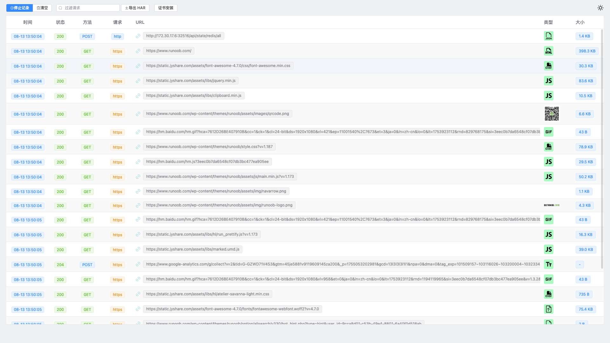
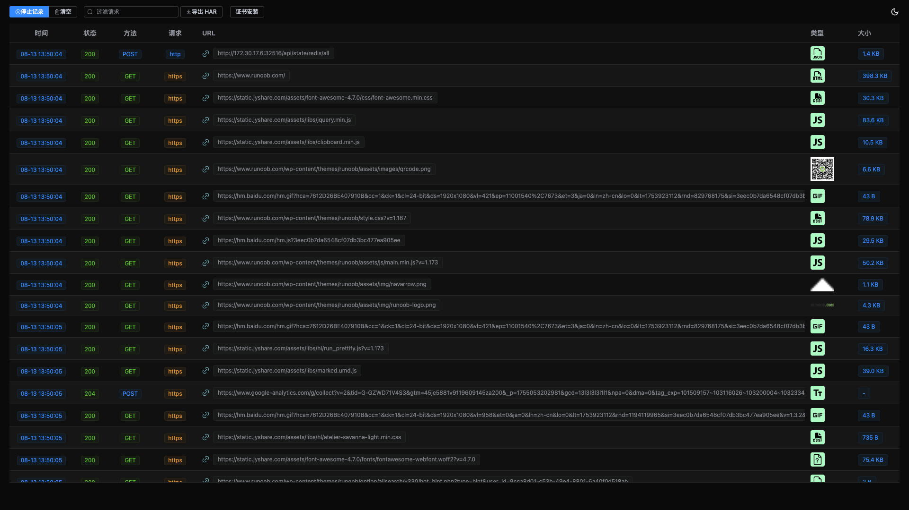
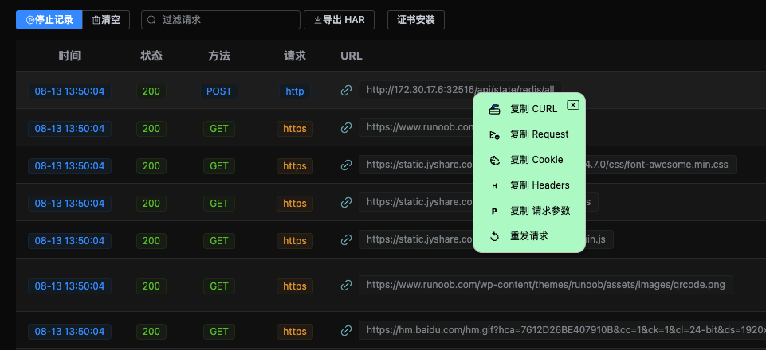
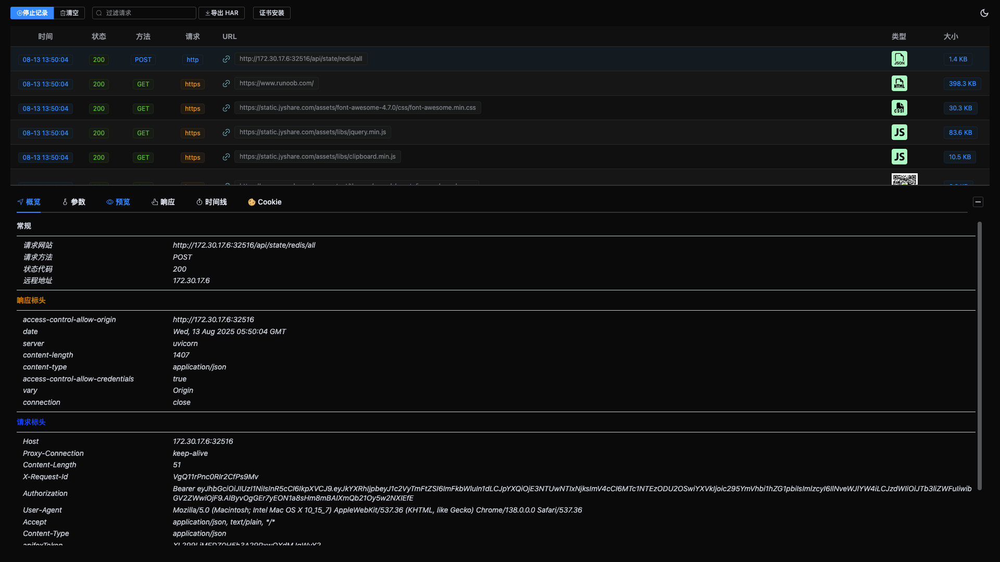

# SnapFlow - 灵嗅

一个基于 `mitmproxy` 的简单高效的抓包工具。
目前仅支持mac系统

## 功能特性

### 已实现功能

- ✅ 支持 HTTP/HTTPS 抓包
- ✅ 默认抓包端口：`12028`
- ✅ 支持生成 CURL 命令
- ✅ 支持生成 Python `requests` 代码
- ✅ 在线预览查看抓包数据

### 待实现功能

- 🔧 动态修改端口
- 🔧 支持 Socket 协议
- 🔧 支持 TCP 协议
- 🔧 支持win系统

## 快速开始

## 贡献

欢迎提交 Issue 和 PR！

## 运行实例

